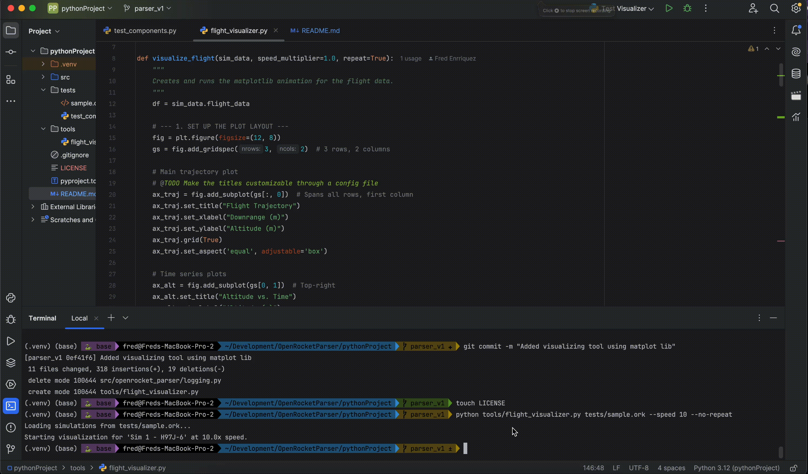

# OpenRocket Parser

A Python library to parse OpenRocket (.ork) XML files and simulation data into convenient Python objects and pandas DataFrames.

## Installation

Temporarily (until the library is available as a pip module), the installation process is a bit more involved.

```bash
# 1. Clone the repo
git clone https://github.com/AIAA-UTD-Comet-Rocketry/openrocket-python-parser

# 2. Create a virtual environment
cd openrocket-python-parser
python -m venv .venv

# 3. Activate the environment
# macOS / Linux
source .venv/bin/activate

# Windows
.venv\Scripts\activate.bat

# 4. Set the library as editable, `.` is the root folder of the cloned repo
pip install -e .

# 5. Install additional dependencies
pip install -r requirements.txt
```

## Basic Usage

Here's how to load simulation data from an OpenRocket file:

```python
from src.openrocket_parser.simulations.loader import load_simulations_from_xml

sims = load_simulations_from_xml('sample.ork')

if sims:
    # Get the first simulation
    my_sim = sims[0]

    print(f"Loaded simulation: {my_sim.name}")
    print(f"Time to Apogee: {my_sim.summary.get('timetoapogee')} seconds")

    # The flight data is a pandas DataFrame
    flight_df = my_sim.flight_data

    # Print the max altitude from the time-series data
    max_altitude_from_data = flight_df['altitude'].max()
    print(f"Max altitude from data: {max_altitude_from_data:.2f} meters")
```

# Tools
## Visualizer

The visualizer tools allows to visualize the simulation data in real-time, directly from the simulation results in OpenRocket



### Basic Usage
```shell
usage: flight_visualizer.py [-h] [--sim SIM] [--speed SPEED] [--no-repeat] file

Animate OpenRocket flight simulation data tool.

positional arguments:
  file           Path to the OpenRocket (.ork) file.

options:
  -h, --help     show this help message and exit
  --sim SIM      The simulation number to visualize (1-based index). Default is 1.
  --speed SPEED  Playback speed multiplier (e.g., 2 for 2x speed, 0.5 for half speed). Default is 1.0.
  --no-repeat    Disable the animation from repeating when it finishes.
```

For convenience, a sample open rocket with basic information can be found in tests/sample.ork

```shell
# This runs the sample.ork simulation data at twice the speed, without repeating
python tools/flight_visualizer.py tests/sample.ork --speed 2 --no-repeat
```